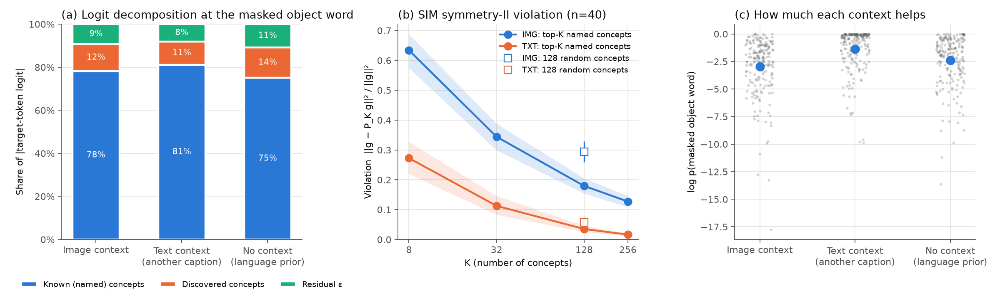

# M0 诊断工具与试跑（pilot）

> 2026-09-26。**这是测量工具的验证，不是 M0 的结论。**投影器只在 1K 条 LLaVA 样本上训练过，而且没有 Stage 2（LoRA）。按 PID 的发现，诊断结论要等 Stage 2 之后才能下。
> 代码：`src/smm/diagnostics.py`，`scripts/m0_diagnostics.py`，`scripts/m0_analyze.py`。数据：`results/week1/m0_pilot/`（`m0_pilot_records.json` 是逐样本记录，`m0_pilot_summary.json` 是汇总，`m0_pilot.png` 是图）。

## 设计
- **同一目标词、三种信息来源：**取 COCO val2017 描述 A 里、图中确实标注了的物体词（例如 "bicycle"），把它 mask 掉。
  - **IMG**：576 个图像 token + 指令 + 描述 A（目标词被 mask）
  - **TXT**：指令里附上同一张图的另一条描述 B + 描述 A（目标词被 mask）
  - **NONE**：只有指令 + 描述 A（目标词被 mask），相当于语言先验，加上描述 A 其余部分泄露的信息
- **样本量：**200 个样本，每个取一个目标词，一个样本就是一个统计单位；其中 40 个样本额外做 SIM 检验。置信区间是 95% bootstrap（条件之间的差值用配对 bootstrap）。
- **所有测量都在被 mask 的位置上做。**E7 的结论是：Steerling 在干净位置上的读出没有意义。
- **指标 1：对数值精确分解。**目标 token 的 logit = W_y·known + W_y·discovered + W_y·ε。三项相加严格等于 logit，因为 ε 修正保证 composed = hidden。报告各项绝对值的占比，与官方 `logit_contribution` notebook 的口径一致。
- **指标 2：SIM 对称性 II 违反度。**
  - g_f = ∂(W_y·h)/∂x，g_k = ∂(w_k·h)/∂x。其中 x 是上下文（图像 token，或描述 B 的 token）的输入嵌入，h 是目标位置的最终隐状态，w_k 是概念头预测器的第 k 行。
  - 违反度 = ‖g_f − P_K g_f‖² / ‖g_f‖²，P_K 是在"当前位置激活最高的前 K 个已命名概念的梯度"所张成子空间上的投影。
  - 同时用 128 个随机概念作为机会水平的对照。

## 结果（均值 [95% CI]）

| 指标 | IMG | TXT | NONE |
|---|---|---|---|
| 已命名概念占 \|logit\| 的比例 | 78.3% [76.3, 80.2] | 81.1% [79.4, 82.8] | 75.1% [72.9, 77.2] |
| discovered 占比 | 12.5% | 10.8% | 14.1% |
| ε 占比 | 9.3% | 8.1% | 10.8% |
| log p(目标词) | −2.97 [−3.33, −2.61] | −1.38 [−1.64, −1.11] | −2.39 [−2.70, −2.09] |
| 映射到的 COCO 概念进入前 32 的比例 | 68% | 90.5% | 77% |
| SIM 违反度，K=128（n=40） | 0.179 [0.154, 0.205] | 0.035 [0.026, 0.046] | — |
| SIM 违反度，128 个随机概念 | 0.294 | 0.057 | — |
| 前 128 个概念相对机会水平的改善 | 39% [35, 43] | 37% [32, 41] | — |

- 配对差：已命名概念占比 IMG−TXT = −2.9 个百分点 [−4.3, −1.5]；log p 的 IMG−NONE = **−0.58** [−0.92, −0.24]，TXT−NONE = +1.02 [0.73, 1.30]。

## 解读
1. **测量工具能用，而且区分度够。**200 个样本时，占比的置信区间宽约 ±2 个百分点；40 个样本时，SIM 的置信区间宽约 ±0.025。三个条件之间的差异都能测出来。纯文本条件下，K=256 时违反度为 0.016，和 SIM 原文"K≈500 时 < 0.1"的结论一致，工具与原文口径吻合。
2. **这次试跑的图像条件不能用来讲动机。**图像不仅没帮上忙，反而**降低**了预测（log p 比 NONE 低 0.58），映射概念的命中率也下降了（68% 对 77%）。原因是 1K 样本训出的投影器在 COCO 上等于在输入里加噪声，而不是提供视觉信息。所以现在看到的 IMG 和 TXT 的差别，不能解释为"视觉信息绕开了概念"。
3. **SIM 违反度的原始值有混杂，必须归一化。**IMG 的原始违反度（0.18）远高于 TXT（0.035），但随机对照也同样高（0.29 对 0.057）。按"相对机会水平的改善"来看，两者几乎一样（39% 对 37%）。原始差距主要来自上下文的维度和结构不同（图像 576 个 token，约 236 万维；描述 B 只有 10 多个 token），而不是概念通路的差别。**正式的 M0 必须报告相对机会水平的归一化指标，或者匹配上下文的规模。**
4. **对数值分解显示，已命名概念在三种条件下都占主导（75–81%）。**IMG 比 TXT 低 2.9 个百分点，方向上符合"接入图像后概念依赖下降"的假设，但幅度很小，而且当前的投影器不可信，不能作为结论。
5. **一个值得跟进的现象：**NONE 条件下 ε 和 discovered 的占比最高。说明模型没有上下文、只能靠语言先验时，更多依赖未命名的通路。正式实验里可以把它当作"概念依赖程度"的参照点。

## 正式 M0 还需要做的
- **Stage 1：**10 万量级的样本（A100 上 1 个 epoch 约 3–4 小时）。先确认在 COCO 上 IMG 的 log p 明显**高于** NONE，也就是图像真的在提供信息，再做诊断。
- **Stage 2：**LoRA 指令微调之后再测一遍（依据 PID）。
- **SIM 的比较：**用"相对机会水平的改善"做主指标，并补一个匹配规模的对照，例如只取 IMG 中与目标梯度范数最大的前 m 个图像 token。
- **增加 K=512，与 SIM 原文对齐。**代价是每个样本的时间约翻倍，可以把 SIM 的样本量控制在 40–60 个。
