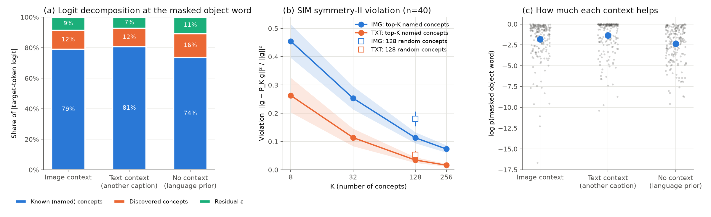
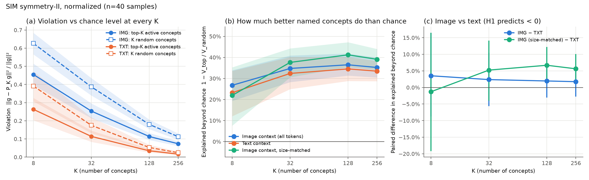

# M0 正式诊断：Stage 1 之后（MLP 投影层为主，重采样器作弱参照）

> 2026-09-27。接入层只训练了 Stage 1（语言模型冻结，10 万条 LLaVA 样本）。按 PID 的发现，Stage 2（LoRA）之后还要再测一遍。
> - 数据：`results/m0_stage1_{mlp,resampler}/`（逐样本记录、汇总、两张图）。
> - 置信度控制：`scripts/m0_confidence_control.py`，输出在 `results/m0_stage1_confidence_control.txt`。
> - 设计与试跑相同（`docs/m0_pilot.md`）：200 个 COCO 样本，对被 mask 的物体名词读出；其中 40 个做 SIM 检验，并加入每个 K 的随机对照和规模匹配对照。

## 前提：图像真的在提供信息吗？
| 接入层 | log p：IMG − NONE | 是否可用 |
|---|---|---|
| MLP | **+0.53** [0.19, 0.84] | 可用 |
| 重采样器（64 个查询，学习率 1e-3） | −0.84 [−1.05, −0.65] | 不可用：图像等于噪声（正在做消融） |

作为参照，TXT − NONE = +1.00。所以对于判断被 mask 的物体词，MLP 接入的图像能提供的信息约为"另一条人工描述"的一半。

## 主要结果（MLP，均值 [95% CI]）
| 指标 | IMG | TXT | NONE |
|---|---|---|---|
| 已命名概念占 \|logit\| 的比例 | 79.0% | 80.8% | 73.6% |
| discovered 占比 / ε 占比 | 12.3% / 8.7% | 11.9% / 7.4% | 15.7% / 10.7% |
| 映射到的 COCO 概念进入前 32 的比例 | 79.5% | 90.0% | 73.0% |
| SIM 原始违反度，K=128 | 0.113 | 0.035 | — |
| SIM 相对随机概念的改善，K=128 | 36.5% [31, 42] | 34.5% [29, 40] | — |
| SIM 相对随机概念的改善，K=128，规模匹配（约 12 个图像 token） | 41.2% [35, 47] | — | — |

## 三个层次的比较
1. **原始差距看起来支持 H1：**
   - 已命名概念占比 IMG 比 TXT 低 1.7 个百分点 [−3.0, −0.5]；
   - 映射概念的命中率低 10.5 个百分点；
   - SIM 原始违反度高出 3 倍（配对差 +0.079 [0.061, 0.097]）。
2. **控制上下文规模之后，SIM 的差距消失：**
   - 相对随机概念的改善，IMG−TXT = +2.0 个百分点 [−3.0, +6.9]，不显著；
   - 规模匹配的 IMG−TXT = **+6.7** 个百分点 [+1.3, +12.2]。也就是说，看最重要的约 12 个图像 token 时，图像的梯度方向被已命名概念解释得反而**更好**。
3. **控制预测置信度之后，占比的差距也消失：**
   - 已命名概念占比随 log p 单调上升，每 1 nat 上升 2.7 个百分点 [1.9, 3.5]；
   - 控制 log p 后，IMG vs TXT = **−0.45** 个百分点 [−1.65, +0.74]，不显著；NONE vs TXT = −4.5 个百分点，仍然显著；
   - 原始的 −1.7 个百分点，主要是因为图像给的信息比另一条描述少，模型对答案不那么确定。

## 结论
- **在 Stage 1 + MLP + COCO 物体名词这个设置下，H1（视觉信息绕开已命名概念）没有得到支持。**
  - 视觉信息到达物体名词预测时，走已命名概念通路的程度和文本相当；
  - 原始指标上的差距，可以用上下文规模和预测置信度解释。
- **重采样器（弱参照）：**图像是噪声时，已命名概念占比即使控制了置信度也低 5 个百分点，和 NONE 的 −4.7 个百分点相当。可以理解为：图像信息不可用时，模型更依赖未命名的通路。这属于"接入质量"问题，不是"模态"问题。
- **局限（也是下一步的方向）：**
  - (a) 物体名词是对概念最友好的情况，本来就有现成的命名概念。H1 更可能在**颜色、数量、空间关系、纹理、细粒度属性**这类未必有对应命名概念的视觉信息上成立；
  - (b) 语言模型冻结时，视觉信息只能借用现有的通路。Stage 2 用 LoRA 改动语言模型之后，才可能出现"新开的旁路"（PID 的观点）；
  - (c) 目前测的是在被 mask 位置上的读出，没有覆盖生成过程中的幻觉情形（H3）。
